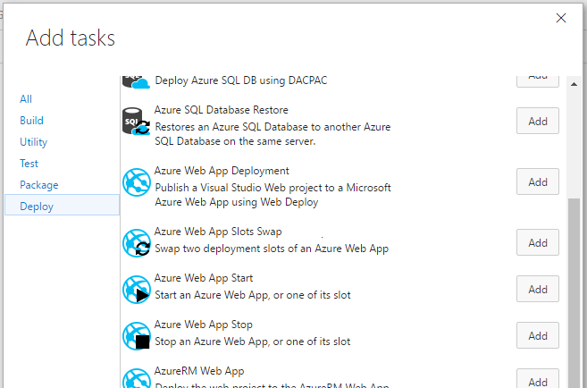

# Build and release tasks for Microsoft Azure

Visual Studio Team Services Build and Release Management extensions that help you to build and publish your applications on Microsoft Azure.

[Learn more](https://github.com/geeklearningio/gl-vsts-tasks-azure/wiki) about this extension on the wiki!

## Tasks included

* **[Azure Web App Slots Swap](https://github.com/geeklearningio/gl-vsts-tasks-azure/wiki/Azure-Web-App-Slots-Swap)**: Swap two deployment slots of an Azure Web App
* **[Azure Web App Start](https://github.com/geeklearningio/gl-vsts-tasks-azure/wiki/Azure-Web-App-Start)**: Start an Azure Web App, or one of its slot
* **[Azure Web App Stop](https://github.com/geeklearningio/gl-vsts-tasks-azure/wiki/Azure-Web-App-Stop)**: Stop an Azure Web App, or one of its slot
* **[Azure SQL Execute Query](https://github.com/geeklearningio/gl-vsts-tasks-azure/wiki/Azure-SQL-Execute-Query)**: Execute a SQL query on an Azure SQL Database
* **[Azure SQL Database Restore](https://github.com/geeklearningio/gl-vsts-tasks-azure/wiki/Azure-SQL-Database-Restore)**: Restore an Azure SQL Database to another Azure SQL Database on the same server using the latest point-in-time backup
* **[Azure SQL Database Incremental Deployment](https://github.com/geeklearningio/gl-vsts-tasks-azure/wiki/Azure-SQL-Database-Incremental-Deployment)**: Deploy an Azure SQL Database using multiple DACPAC and performing incremental deployments based on current Data-Tier Application version
* **[AzCopy](https://github.com/geeklearningio/gl-vsts-tasks-azure/wiki/AzCopy)**: AzCopy task

## Steps

After installing the extension, you can add one (or more) of the tasks to a new or existing [build definition](https://www.visualstudio.com/en-us/docs/build/define/create) or [release definition](https://www.visualstudio.com/en-us/docs/release/author-release-definition/more-release-definition)

## Learn more

The [source](https://github.com/geeklearningio/gl-vsts-tasks-azure) for this extension is on GitHub. Take, fork, and extend.

## Release Notes

> **10-24-2016**
> - Added: AzCopy Tool Task

> **8-19-2016**
> - Added: Azure SQL Database Incremental Deployment

> **8-1-2016**
> - Added: Azure SQL Execute Query

> **7-31-2016**
> - Added: Azure RM Support
